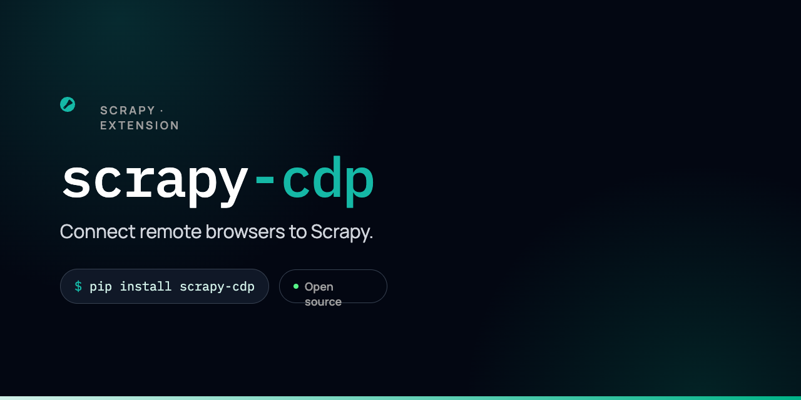

# scrapy-cdp

`scrapy-cdp` is a small CDP renderer for Scrapy. It connects to an
already-running Chromium-compatible browser, loads selected requests through
the Chrome DevTools Protocol (CDP), and returns the rendered DOM as a normal
Scrapy `HtmlResponse`.

The package stays inside Scrapy's downloader lifecycle. Downloader middleware,
slots, delays, retries, signals, stats, callbacks, and errbacks continue to work
as they do for other download handlers. Requests that do not opt in to CDP are
delegated to the HTTP or HTTPS handler that Scrapy would otherwise use.

`scrapy-cdp` does not install, launch, restart, or close the browser. It is a
rendering transport rather than a browser automation framework.

## Features

- Per-request CDP rendering with `request.meta["cdp"] = True`.
- Optional middleware for rendering every request through CDP.
- Normal Scrapy HTTP/HTTPS fallback for unmarked requests.
- HTTP endpoint discovery through `/json/version`.
- Direct `ws://` and `wss://` browser WebSocket connections.
- One isolated browser context per Scrapy crawler.
- A fresh browser target for each rendered request.
- Browser cookies and storage shared across CDP requests from the same crawler.
- Bounded target concurrency with `CDP_MAX_TARGETS`.
- `load`, `domcontentloaded`, and no-wait navigation modes.
- Per-project and per-request timeouts.
- Final browser URL, document status, response headers, and rendered HTML.
- Scrapy-native download errors, latency metadata, and package-specific stats.
- Automatic target cleanup on success, failure, cancellation, and timeout.
- Asyncio reactor and reactorless Scrapy support.
- No Playwright, browser binaries, or generated CDP bindings.

## Requirements

- Python 3.12 or newer.
- Scrapy 2.16 or newer.
- `websockets` 14 or newer.
- An already-running browser that exposes the Chromium CDP methods used by the
  renderer.

The implementation has been exercised with Chromium and Lightpanda. It uses
Chromium CDP domains and does not support Firefox or WebKit protocols.

## Installation

Install the project from the repository:

```bash
pip install .
```

For development with `uv`:

```bash
uv sync --all-groups
```

## Start A Browser

Start Chromium with remote debugging enabled:

```bash
chromium --headless --remote-debugging-port=9222
```

Chrome installations may use a command such as:

```bash
google-chrome --headless --remote-debugging-port=9222
```

Keep the debugging endpoint on a trusted interface. A CDP connection gives the
client control over the browser and should not be exposed to an untrusted
network.

## Scrapy Configuration

Enable the add-on and provide the browser endpoint:

```python
ADDONS = {
    "scrapy_cdp.ScrapyCDPAddon": 500,
}

CDP_ENDPOINT = "http://127.0.0.1:9222"
```

When `CDP_ENDPOINT` is an HTTP or HTTPS URL, `scrapy-cdp` requests
`/json/version` and reads `webSocketDebuggerUrl` from the response. The endpoint
may also point directly to the browser WebSocket:

```python
CDP_ENDPOINT = "ws://127.0.0.1:9222/devtools/browser/abc123"
```

An endpoint that already ends in `/json/version` is accepted as-is.

The add-on requires Scrapy's asyncio reactor when a Twisted reactor is in use.
Scrapy's current `AsyncioSelectorReactor` default and reactorless mode are both
supported. The extension is disabled with `NotConfigured` if `CDP_ENDPOINT` is
missing or a non-asyncio reactor is installed.

## Selective Rendering

Set `meta["cdp"]` on requests that require JavaScript rendering:

```python
import scrapy


class ProductSpider(scrapy.Spider):
    name = "products"

    async def start(self):
        yield scrapy.Request(
            "https://example.com/products",
            meta={"cdp": True},
        )

    def parse(self, response):
        self.logger.info("Response flags: %s", response.flags)
        yield {
            "title": response.css("h1::text").get(),
            "url": response.url,
        }
```

The callback receives a regular `HtmlResponse`. Existing selectors, item
pipelines, callbacks, and feed exports do not need CDP-specific APIs.

Requests without a truthy `meta["cdp"]` value use Scrapy's original effective
handler for their URL scheme. The fallback handler is created lazily, so a
CDP-only crawl does not initialize an unused HTTP client.

## Render Every Request

A downloader middleware can mark requests before the download handler is
selected. The included project under `cdp_test/` uses this middleware:

```python
from scrapy import Request


class CDPDownloaderMiddleware:
    def process_request(self, request: Request) -> None:
        request.meta["cdp"] = True
```

Enable it in the project's settings:

```python
DOWNLOADER_MIDDLEWARES = {
    "myproject.middlewares.CDPDownloaderMiddleware": 50,
}
```

That version deliberately overwrites any existing value and sends every HTTP
and HTTPS request through CDP. To retain a per-request opt-out, use
`request.meta.setdefault("cdp", True)` and set `meta={"cdp": False}` where a
normal HTTP request is required.

## Request Options

Two project defaults can be overridden for one request:

```python
yield scrapy.Request(
    "https://example.com/app",
    meta={
        "cdp": True,
        "cdp_wait_until": "domcontentloaded",
        "cdp_timeout": 15,
    },
)
```

### `cdp_wait_until`

Controls how long navigation waits before the DOM is serialized:

| Value | Behavior |
| --- | --- |
| `"load"` | Wait for the top-level frame's correlated `load` lifecycle event. |
| `"domcontentloaded"` | Wait for the top-level frame's correlated `DOMContentLoaded` lifecycle event. |
| `"none"` | Continue after `Page.navigate` returns without waiting for a lifecycle event. |

The default is inherited from `CDP_WAIT_UNTIL`. Invalid values raise
`ValueError`.

`"none"` can return before deferred scripts or asynchronous page updates have
finished. It is intended for pages where navigation completion is unnecessary
or handled elsewhere.

### `cdp_timeout`

Sets the total time allowed for the request, including waiting for an available
target slot, browser setup, navigation, lifecycle waiting, and DOM extraction.
The value is in seconds and defaults to `CDP_REQUEST_TIMEOUT`.

## Settings Reference

| Setting | Default | Description |
| --- | ---: | --- |
| `CDP_ENDPOINT` | required | HTTP(S) debugging endpoint or direct browser WebSocket URL. |
| `CDP_CONNECT_TIMEOUT` | `10.0` | Timeout in seconds for endpoint discovery and WebSocket connection. |
| `CDP_REQUEST_TIMEOUT` | `30.0` | Total timeout in seconds for one rendered request. |
| `CDP_MAX_TARGETS` | `8` | Maximum number of concurrent browser targets for one crawler. Must be at least 1. |
| `CDP_WAIT_UNTIL` | `"load"` | Default wait mode: `"load"`, `"domcontentloaded"`, or `"none"`. |

The internal `SCRAPY_CDP_FALLBACK_HTTP_HANDLER` and
`SCRAPY_CDP_FALLBACK_HTTPS_HANDLER` settings are populated by the extension.
They preserve the effective handlers that were configured before `scrapy-cdp`
wrapped the `http` and `https` schemes. Applications should not normally set
them directly.

## Response Semantics

For a rendered request, the returned `HtmlResponse` contains:

- The final URL from the top-level browser frame.
- The final document response status, or `200` when CDP did not report one.
- Headers from the final document response.
- The serialized document returned by `DOM.getOuterHTML`.
- UTF-8 body encoding and `Content-Type: text/html; charset=utf-8`.
- The original Scrapy request.
- A `"cdp"` entry in `response.flags`.

The body is the rendered DOM, not the original response bytes. The renderer
removes `Content-Encoding` and `Content-Length` because those headers describe
the network body and are no longer valid after DOM serialization.

Browser redirects are reflected in the final URL and final document metadata.
They are not emitted as a chain of Scrapy redirect responses, so
`RedirectMiddleware` does not process each browser-side redirect separately.

The renderer records total elapsed time in
`request.meta["download_latency"]`. This keeps latency-aware Scrapy components,
including AutoThrottle, on the normal downloader path.

## Browser Context And Targets

Each Scrapy crawler owns one CDP service, one WebSocket connection, and one
isolated browser context. The context is created lazily on the first marked
request.

Browser-managed cookies, local storage, and other context state persist across
that crawler's rendered requests. They are not shared between separate
crawlers. Each request still receives a new target, equivalent to a disposable
tab, which is closed after the response has been built.

`CDP_MAX_TARGETS` limits how many of those targets can exist concurrently. A
request waiting for the semaphore remains subject to its total
`cdp_timeout`. Scrapy's own concurrency settings and download slots still apply
outside this target limit.

If the WebSocket disconnects, active commands fail. A later request can connect
again and creates a new browser context for the new connection generation. The
browser itself is never restarted by this package.

When the Scrapy engine stops, `scrapy-cdp`:

1. Rejects new render operations.
2. Disposes its browser context when the connection is still available.
3. Closes its WebSocket connection.
4. Leaves the externally managed browser running.

Per-request cleanup closes targets in a shielded, bounded operation so a
cancelled or timed-out crawl does not intentionally leave tabs behind.

## Scrapy Integration

The add-on installs a crawler extension, which wraps Scrapy's effective `http`
and `https` download handlers. The wrapper chooses its transport from the
request metadata:

```text
Scrapy request
    -> downloader middleware
    -> CDPDownloadHandler
        -> meta["cdp"] is truthy: CDPService
        -> otherwise: original HTTP/HTTPS handler
    -> downloader middleware
    -> spider callback or errback
```

Keeping CDP at the download-handler layer means rendered requests retain
Scrapy's downloader slots and delays, downloader middleware response and
exception processing, downloader statistics, retries, and errbacks. Returning
a response directly from downloader middleware would bypass part of that
accounting, which is why middleware is used only to set options in the
always-on example.

The shared CDP connection uses one reader task and command IDs to multiplex
concurrent protocol calls. Target events are routed to queues by flattened CDP
session ID, preventing one tab's lifecycle events from completing another
tab's request.

## Errors And Retries

CDP failures are not converted into synthetic successful responses:

- A total request timeout raises Scrapy's `DownloadTimeoutError`.
- Connection, protocol, and navigation failures raise Scrapy's
  `DownloadFailedError`.
- A marked non-GET request raises Scrapy's `NotSupported`.
- Invalid wait settings raise `ValueError`.

These exceptions continue through downloader middleware. Scrapy's retry
middleware can retry the download errors according to the project's normal
retry settings, and unhandled failures reach the request errback.

The protocol transport also fails all pending commands when the browser closes
the WebSocket, rather than leaving request coroutines waiting indefinitely.

## Statistics

The service records these crawler stats:

| Stat | Meaning |
| --- | --- |
| `scrapy_cdp/request_count` | Marked requests accepted by the renderer. |
| `scrapy_cdp/response_count` | Rendered responses returned successfully. |
| `scrapy_cdp/target_count` | Browser targets created. |
| `scrapy_cdp/timeout_count` | Requests that exceeded their CDP timeout. |
| `scrapy_cdp/error_count` | CDP connection, protocol, or download failures. |

Scrapy's standard downloader stats are also recorded because the wrapper runs
inside the normal download path. This includes request counts, response status
counts, byte counts, and exception counts.

## Included Test Project

`cdp_test/` is a conventional Scrapy project that crawls the JavaScript version
of [Quotes to Scrape](https://quotes.toscrape.com/js/). The raw HTML contains
the quote data in a script; the `.quote` elements consumed by the spider are
created by JavaScript.

The project enables `CDPDownloaderMiddleware`, so its spider contains no
per-request CDP metadata. With a browser listening on port 9222, run:

```bash
cd cdp_test
uv run scrapy crawl quotes_js -O quotes.jsonl
```

Override the endpoint through the environment when needed:

```bash
CDP_ENDPOINT=http://127.0.0.1:9333 \
    uv run scrapy crawl quotes_js -O quotes.jsonl
```

A complete crawl currently visits 10 rendered pages and exports 100 quote
items. This project has also been run end to end against Lightpanda at
`127.0.0.1:9222`.

## Development And Testing

Install all dependency groups, then run the test and quality checks:

```bash
uv sync --all-groups
uv run pytest
uv run ruff check .
uv run ruff format --check .
uv build
```

The automated suite uses a fake CDP browser and covers:

- Out-of-order command responses and event routing.
- CDP protocol errors and connection cleanup.
- Rendered response URL, status, headers, body, and flags.
- Browser context reuse and per-request target cleanup.
- Timeouts, non-GET rejection, and bounded concurrency.
- Marked request routing and normal-handler fallback.
- Fallback handler shutdown.
- A full Scrapy `AsyncCrawlerRunner` lifecycle in reactorless mode.

## Current Limitations

The initial release is intentionally limited:

- Only Chromium-compatible CDP endpoints are supported.
- The browser must already be running and externally managed.
- CDP rendering supports `GET` requests only.
- There are no click, fill, type, evaluate, wait-for-selector, screenshot,
  download, or other page automation commands.
- There is no request interception or resource blocking.
- Scrapy request headers and bodies are not copied into browser navigation.
- Scrapy cookie jars are not synchronized with browser cookies.
- Per-request Scrapy proxy settings are not applied to the browser.
- Browser contexts cannot yet be selected, named, or configured per request.
- Browser downloads and non-HTML response bodies are not exposed.
- Browser-side redirect history is not reconstructed as Scrapy redirect
  metadata.
- `networkidle` waiting is not implemented.
- A non-asyncio Twisted reactor is not supported.

These boundaries keep the runtime dependency small and the transport behavior
predictable. Features that require browser interaction, request interception,
or Scrapy-to-browser state synchronization need explicit CDP implementations
rather than pretending ordinary `Request` fields already map to browser
navigation.
